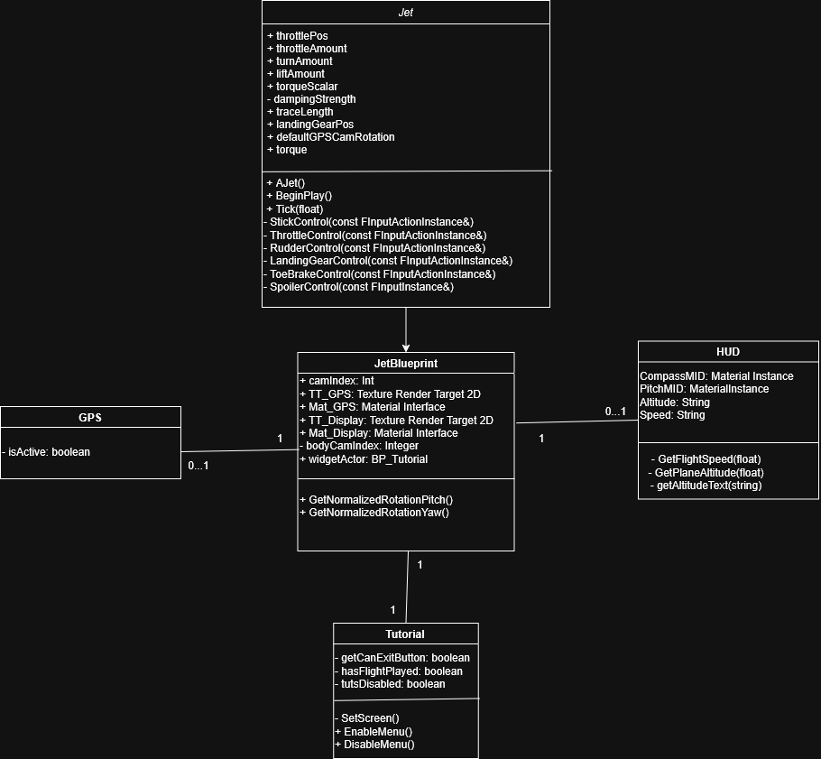

# Technical Documentation
This document is for technical information. More general information about the project can be found on the readme.md file or on our [website](https://xlrseatingbuck-org.github.io/unreal-plane.html)

## Project Overview

The simulation simply places an airplane inside of the Albany, Oregon airport. The user, with the help of tutorials should they be enabled, is to fly to Corvallis using an airplane that obeys real-world physics

## Enviroment

The environment is rendered using Ceisum's Google 3d tiles. The tiles are low-fidelity which looks fairly unrealistic up close but nearly photo-realistic while in the air. Bing's road map tiles are also used to render the GPS system below the map.

# Classes

## Jet

The main driver of the software. The jet c++ class manages the states of different components of the jet such as the landing gears. Most of the methods are callback functions that return the state of different inputs. Trace length is a line trace at the bottom of the airplane that tracks it's current height. The height of an airplane affects the tutorial trigger for flight but it's also necessary here because airplanes behave differently at different altitudes.
An airplane experiences more resistance at different heights. An A-10C warthog Jet (the plane that the simulation was modeled after) works the best at 80,000 km high. This is "cruising altitude" and it's the height where the plane experiences the least resistance from gravity. This means adjusting your torque less and it also means turning the plane quickly is easier in general.

## JetBlueprint

A child class derived from the c++ class. It primarily acts as a manager for the other classes to latch onto. It communicates pitch and yaw to the HUD class to rotate the compass correctly and it sends location data to the GPS class to track current location on the map.

## Tutorial

The tutorial class is primarily driving a widget object to instruct the user on how to fly an airplane. The SetScreen() method sets up the use of the buttons while the enable and disable menu are used to invoke different pages of the widget and change input types so that the widget can be interacted with.

## HUD

A tool inside of jet planes that shows the pilot their pitch, yaw, speed, and altitude. They can also be used to highlight targets but that feature was not used for this simulation.

# Building and Releasing

1. Open Unreal and the Unreal Plane project
2. Select the platforms dropdown->Windows->package project
3. Zip files
5. [Create a new release on the repository](https://github.com/XLRSeatingBuck-Org/unreal_jet/releases/new)
